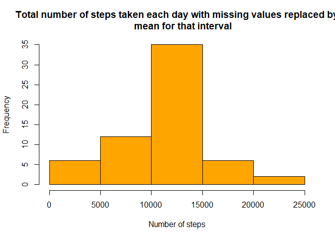
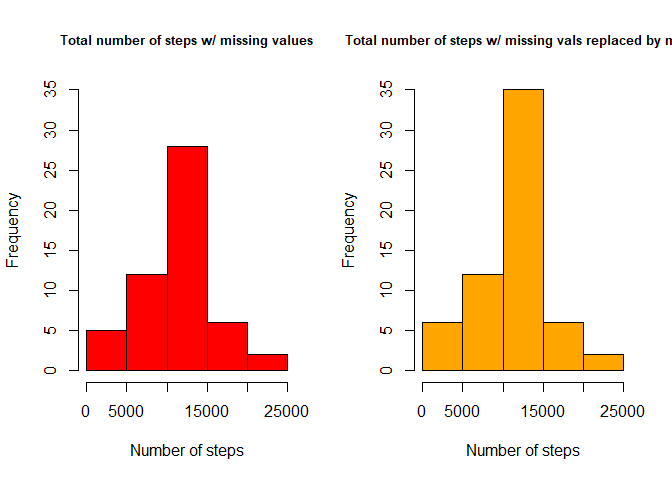
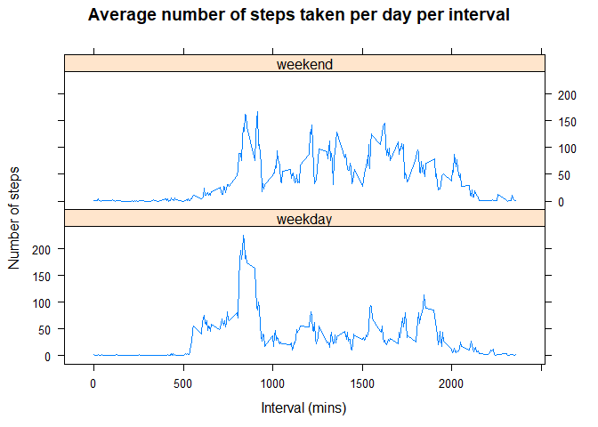

##Introduction
It is now possible to collect a large amount of data about personal movement
using activity monitoring devices such as a Fitbit, Nike Fuelband, or Jawbone
Up. These type of devices are part of the "quantified self" movement - a group
of enthusiasts who take measurements about themselves regularly to improve
their health, to find patterns in their behavior, or because they are tech geeks.
But these data remain under-utilized both because the raw data are hard to
obtain and there is a lack of statistical methods and software for processing and
interpreting the data.

This assignment makes use of data from a personal activity monitoring device.
This device collects data at 5 minute intervals through out the day. The data
consists of two months of data from an anonymous individual collected during
the months of October and November, 2012 and include the number of steps
taken in 5 minute intervals each day

## Data
The variables included in this dataset are:
. steps : Number of steps taking in a 5-minute interval (missing values are
coded as NA)
. date : The date on which the measurement was taken in YYYY-MM-DD
format
. interval : Identifier for the 5-minute interval in which measurement was
taken
The dataset is stored in a comma-separated-value (CSV) file and there are a
total of 17,568 observations in this dataset.

##Loading the data

```r
## Download and unzip the data, provided it doesn't already exist
if(!file.exists("activity.csv")){
  fileUrl<-"https://d396qusza40orc.cloudfront.net/repdata%2Fdata%2Factivity.zip"
  download.file(fileUrl,destfile="activityMonitorData.zip",method="curl")
  unzip("activityMonitorData.zip")
}

## Read in the data
data <- read.csv("activity.csv", header = TRUE, sep = ",")
```


### What is mean total number of steps taken per day?

```r
## Aggregate the steps data by date
stepsPerDay <- aggregate(steps ~ date, data, sum)

## Histogram of the Total number of steps taken each day
hist(stepsPerDay$steps, col="red",
            main="Total number of steps taken each day",
            xlab = "Number of steps")
```

<!-- -->

```r
## Mean of total number of steps taken per day
mean <- mean(stepsPerDay$steps)
print(mean)
```

```
## [1] 10766.19
```

```r
## Median of total number of steps taken per day
median <- median(stepsPerDay$steps)
print(median)
```

```
## [1] 10765
```

### What is the average daily activity pattern?

```r
## Aggregate the average of the steps data by interval
stepsInt <- aggregate(steps ~ interval, data, "mean")
## Time series plot of the interval and the average number of steps taken
plot(stepsInt$interval, stepsInt$steps, type = "l",
     main = "Average number of steps taken per day per interval",
     xlab = "Interval (mins)", ylab = "Number of steps")
```

<!-- -->

```r
## Interval containing the maximum number of steps
stepsInt[which.max(stepsInt$steps),1]
```

```
## [1] 835
```

### Missing values

```r
## Totla number of missing values
sum(is.na(data))
```

```
## [1] 2304
```

```r
## New dataset with missing values filled in by mean
## Creating a new DF from the original
dataF <- data
## Matching the interval from the original DF to the interval of the average
## steps per interval DF
stepsMean <- stepsInt$steps[match(data$interval, stepsInt$interval)]
## Replacing the NAs in the new DF with the averages per interval
dataF$steps<-ifelse(is.na(data$steps)==TRUE,stepsMean, data$steps)
##Replace the steps values for the first day with 0 to match the second day
dataF[dataF$date == "2012-10-01",1] <- 0

## Aggregate the steps data by date
stepsPerDayF <- aggregate(steps ~ date, dataF, sum)
## Histogram of the Total number of steps taken each day with full data
hist(stepsPerDayF$steps, col="orange",
     main="Total number of steps taken each day with missing values replaced by
     mean for that interval", xlab = "Number of steps")
```

<!-- -->

```r
## Mean of total number of steps taken per day
meanF <- mean(stepsPerDayF$steps)
print(meanF)
```

```
## [1] 10589.69
```

```r
## Median of total number of steps taken per day
medianF <- median(stepsPerDayF$steps)
print(medianF)
```

```
## [1] 10766.19
```

```r
## Difference between values
par(mfrow=c(1,2))
hist(stepsPerDay$steps, col="red",
            main="Total number of steps w/ missing values",
            xlab = "Number of steps",cex.main=.8,ylim = c(0,35))
hist(stepsPerDayF$steps, col="orange",
     main="Total number of steps w/ missing vals replaced by mean",
     xlab = "Number of steps",cex.main=.8)
```

<!-- -->

```r
## Difference between the mean and median from the original data and the 
## filled in DF
meanD <- meanF - mean
print(meanD)
```

```
## [1] -176.4949
```

```r
medianD <- medianF - median
print(medianD)
```

```
## [1] 1.188679
```

```r
## Total difference
totalDif <- sum(stepsPerDay$steps) - sum(stepsPerDayF$steps)
print(totalDif)
```

```
## [1] -75363.32
```

### Are there differences in activity patterns between weekdays and weekends?

```r
## Establishing the weekdays
weekdays <- c("Monday", "Tuesday", "Wednesday", "Thursday", 
              "Friday")
## Adding a new variable to the data with either weekday or weekend
dataF$day <- ifelse(is.element(weekdays(as.Date(dataF$date)),weekdays),
                    "weekday", "weekend")

library(lattice)
stepsIntF <- aggregate(steps ~ interval + day, dataF, "mean")
xyplot(stepsIntF$steps ~ stepsIntF$interval | stepsIntF$day, 
       main="Average number of steps taken per day per interval", 
       xlab = "Interval (mins)", ylab = "Number of steps",
       type="l", layout=c(1,2))
```

<!-- -->

As can be seen, there is more activity on the weekend, however, we can see
activity starts sooner during the weekday and results in an interval which has
a higher number of steps.
